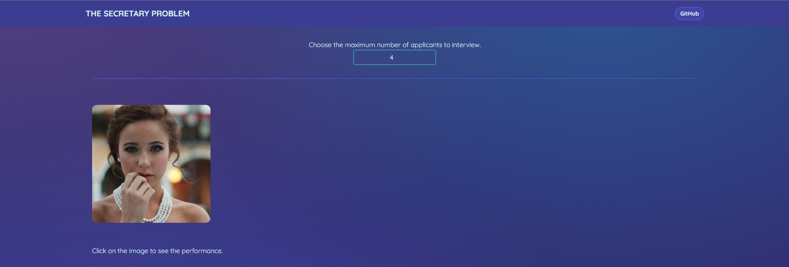
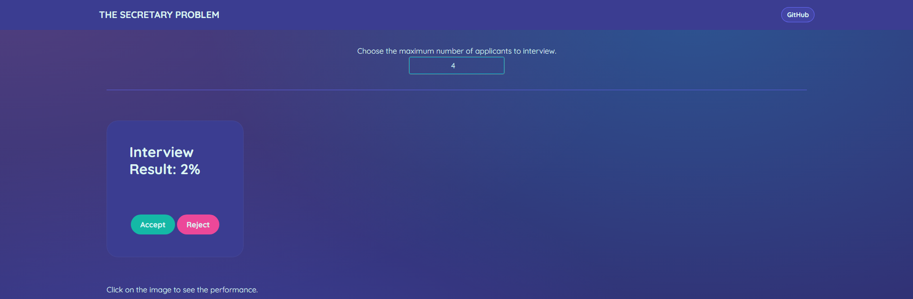
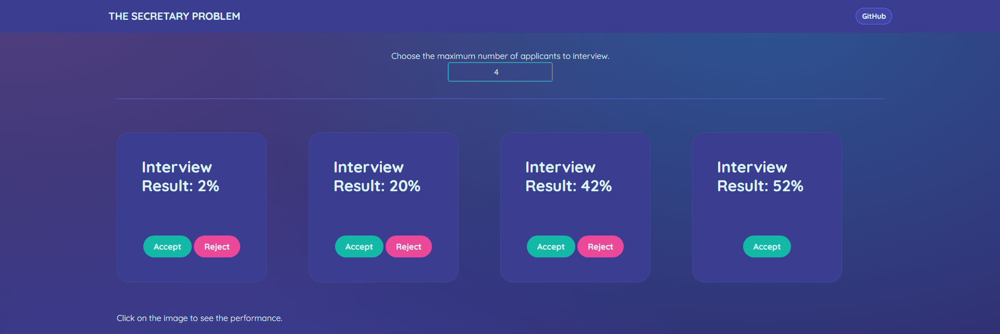
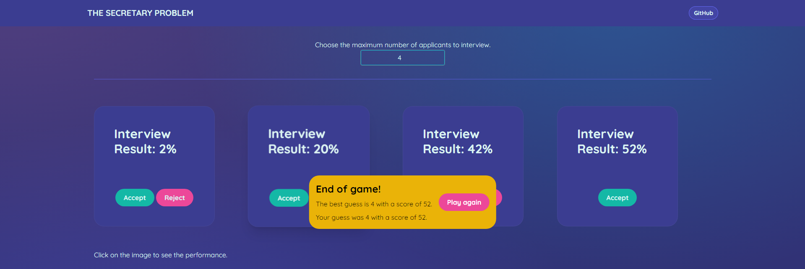

# Introduction
Imagine you have a company, and you want to hire someone for a secretary job.
You start announcing the open position on LinkedIn, to your friends, to your family, and even on Instagram.

Naturally, you want to find the best secretary for this job. However you also know your time is limited, so you can't interview 1000 people for this single job. You decide it is fine to interview up to 20 people.

People starting applying for the job and you start interviewing then. Since you know you cognitive biases, you create objective metrics to measure how the candidates perfomed in the interview. Now, how do you decide whether to hire or not someone, to maximize your chances of finding the best secretary among the 20 interviews?

That's The Secretary Problem.

Rules:
- You interview someone, and you attribute a score to this person. Then, you can either hire or reject.
- If you reject someone, you can't hire him/her in the future.
- You need to decide to hire or reject right after the interview.

The Secretary Problem is also know by other names, such as the marriage problem, the sultan's dowry problem, the fussy suitor problem, the googol game, and the best choice problem. It is a particular scenario of optimal stopping problems.

It is interesting because there is a trade-off between exploring and understanding the problem (i.e. verifying the level of the applicants), and then exploting the information obtained to take action. 

There are also multiple variations, such as adding a cost every time you reject someone, selecting the second best instead of the best candidate, being able to propose an offer for people who you previous rejected, adding probabilities everywhere, etc. For this work, we will focus on the classical version.

# Strategies
Below we have a non-exaustive examples of strategies one may apply to the secretary problem.
- The cutoff rule
You avoid accepting the first _K_ applicants, then you hire the first person better than the first K applicants.
- Candidate count rule
You accept the _K_th applicant.
- The threshold rule
You accept the first candidate whose score is over _K_.

# The game
We created a game which simulated the secretary problem, so the user can experience and test the strategies above, or even a personal strategy. You first select how many candidates you may interview, and then you will see the photo of the first candidate.

By clicking on the image, you can see the interview result, which is a score between 0% and 100%. You also have the buttons to accept or reject.

By clicking on reject, the next candidate appears. This keep happening while you reject until the last candidate, which you have to forcefully accept.

After accepting one candidate, the game ends. It says who you chose and who was the best candidate. Then, you may play again.

